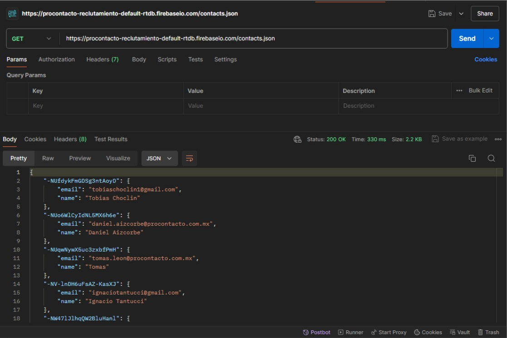
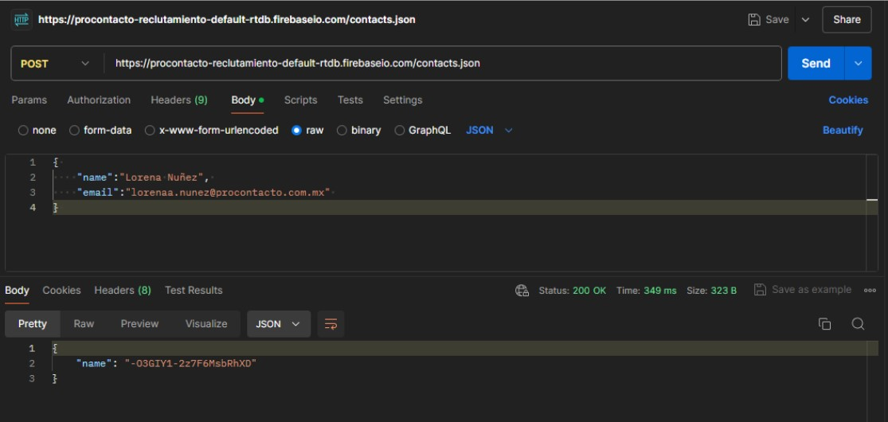
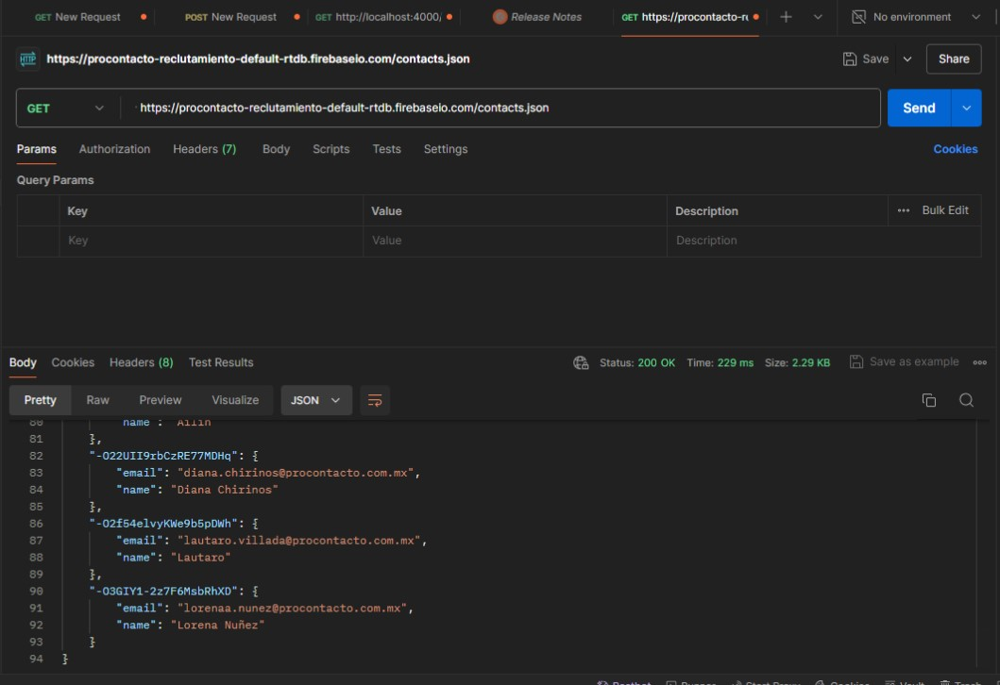

# ProContactoPruebaPractica
Evaluación práctica de reclutamiento para la empresa ProContacto

# Índice

1. [Ejercicio 2: Comprensión del Protocolo HTTP](#ejercicio-2-comprensión-del-protocolo-http)
2. [Ejercicio 3: Postman](#ejercicio-3-postman)
3. [Ejercicio 4: Trailhead](#ejercicio-4-trailhead)
4. [Ejercicio 5: Objetos de Salesforce](#ejercicio-5-objetos-de-salesforce)
5. [Ejercicio 6: Sales force](#ejercicio-6-sales-force)


# Preguntas iniciales

### 1. ¿Qué te motivó a elegir tu carrera profesional?

Elegí mi carrera profesional porque me apasiona la diversidad de aplicaciones que ofrece, la variedad de trabajos que puedo realizar y las diferentes modalidades en las que puedo trabajar. Además, me motiva saber que es un campo con un alcance internacional, lo que me permite colaborar con personas de todo el mundo.

### 2. ¿Qué esperas aprender o lograr en este nuevo rol?

En este nuevo rol, espero mejorar y expandir mis habilidades técnicas y profesionales. Mi objetivo es aprender nuevas tecnologías y metodologías, mejorar mis capacidades de resolución de problemas y contribuir de manera significativa a los proyectos del equipo. También busco desarrollar mis habilidades de liderazgo y comunicación para poder colaborar de manera más efectiva con mis colegas y avanzar en mi carrera.

### 3. ¿Cómo te mantienes actualizado en tu campo profesional?

Me mantengo actualizada en mi campo profesional de varias maneras. Escucho activamente a colegas y expertos en la industria, participando en discusiones y foros. Además, leo regularmente noticias tecnológicas, blogs especializados y artículos académicos.

### 4. ¿Qué valores personales consideras importantes en el ámbito laboral?

Considero que varios valores personales son cruciales en el ámbito laboral:
- **Responsabilidad**: Cumplir con mis obligaciones y compromisos de manera efectiva.
- **Proactividad**: Anticipar problemas y necesidades, y tomar la iniciativa para abordarlos.
- **Manejo del tiempo**: Priorizar tareas y gestionar mi tiempo eficientemente para maximizar la productividad.
- **Respeto**: Tratar a todos mis colegas con dignidad y consideración.
- **Amabilidad**: Fomentar un ambiente de trabajo positivo y colaborativo mediante la cortesía y el apoyo mutuo.

<!-- Agrega dos líneas en blanco entre las secciones -->

# Ejercicio 2: Comprensión del Protocolo HTTP

Las siguientes preguntas están orientadas a la comprensión del protocolo HTTP. Son agnósticas al lenguaje de programación, la idea es comprender los conceptos del estándar.

## 1. ¿Qué es un servidor HTTP?

Un servidor HTTP es un software que comprende y responde a las solicitudes HTTP de los clientes (normalmente navegadores web). Maneja solicitudes entrantes, procesa las solicitudes y devuelve las respuestas apropiadas al cliente, como páginas web, imágenes, videos u otros recursos.

## 2. ¿Qué son los verbos HTTP? Mencionar los más conocidos

Los verbos HTTP, también conocidos como métodos HTTP, son acciones que los clientes pueden solicitar que realice el servidor. Los más conocidos son:

- **GET**: Solicita un recurso del servidor.
- **POST**: Envía datos al servidor para ser procesados.
- **PUT**: Actualiza un recurso existente o crea uno nuevo si no existe.
- **DELETE**: Elimina un recurso del servidor.
- **PATCH**: Aplica modificaciones parciales a un recurso.
- **HEAD**: Similar a GET, pero solo solicita los headers de la respuesta.
- **OPTIONS**: Describe las opciones de comunicación para el recurso de destino.

## 3. ¿Qué es un request y un response en una comunicación HTTP? ¿Qué son los headers?

- **Request**: Es una solicitud enviada por un cliente al servidor. Contiene una línea de solicitud, headers y, opcionalmente, un cuerpo de mensaje.
- **Response**: Es la respuesta enviada por el servidor al cliente. Contiene una línea de estado, headers y, opcionalmente, un cuerpo de mensaje.
- **Headers**: Son pares clave-valor incluidos en las solicitudes y respuestas HTTP que transmiten información adicional sobre la solicitud o respuesta. Ejemplos incluyen `Content-Type`, `Authorization`, `User-Agent`, etc.

## 4. ¿Qué es un queryString? (En el contexto de una URL)

Un queryString es una parte de la URL que se utiliza para pasar parámetros a una página web. Comienza con un signo de interrogación (?) y consiste en pares clave-valor separados por &. Por ejemplo: `http://example.com/page?name=John&age=30`.

## 5. ¿Qué es el responseCode? ¿Qué significado tienen los posibles valores devueltos?

El responseCode es un código de estado en la respuesta HTTP que indica el resultado de la solicitud. Algunos códigos comunes son:

- **1xx (Informational)**: Indica que la solicitud fue recibida y el proceso continúa.
- **2xx (Success)**: Indica que la solicitud fue recibida, entendida y aceptada con éxito.
  - **200 OK**: Solicitud exitosa.
  - **201 Created**: Recurso creado exitosamente.
- **3xx (Redirection)**: Indica que se requieren acciones adicionales para completar la solicitud.
  - **301 Moved Permanently**: El recurso fue movido permanentemente a una nueva URL.
  - **302 Found**: El recurso fue encontrado en una URL diferente.
- **4xx (Client Error)**: Indica errores del cliente.
  - **400 Bad Request**: Solicitud malformada.
  - **401 Unauthorized**: Autenticación requerida.
  - **404 Not Found**: Recurso no encontrado.
- **5xx (Server Error)**: Indica errores del servidor.
  - **500 Internal Server Error**: Error general del servidor.
  - **503 Service Unavailable**: Servicio no disponible.

## 6. ¿Cómo se envía la data en un GET y cómo en un POST?

- **GET**: La data se envía en la URL como parte del queryString. Ejemplo: `http://example.com/page?name=John&age=30`.
- **POST**: La data se envía en el cuerpo de la solicitud. No es visible en la URL.

## 7. ¿Qué verbo HTTP utiliza el navegador cuando accedemos a una página?

El navegador utiliza el verbo **GET** cuando accedemos a una página web.

## 8. Explicar brevemente qué son las estructuras de datos JSON y XML dando ejemplo de estructuras posibles.

**JSON (JavaScript Object Notation)**: Es un formato de datos ligero y fácil de leer/escribir para humanos y máquinas. Utiliza pares clave-valor y listas ordenadas.
```json
{
  "name": "John",
  "age": 30,
  "children": ["Anna", "Billy"]
}
```

XML (eXtensible Markup Language): Es un formato de datos más rígido que JSON, utilizado para almacenar y transportar datos. Usa etiquetas para definir elementos.

```xml
<person>
  <name>John</name>
  <age>30</age>
  <children>
    <child>Anna</child>
    <child>Billy</child>
  </children>
</person>
```


## 9. Explicar brevemente el estándar SOAP
SOAP (Simple Object Access Protocol) es un protocolo de comunicación que utiliza XML para estructurar mensajes y permite la comunicación entre aplicaciones a través de redes, especialmente en servicios web. Es independiente del lenguaje de programación y puede funcionar sobre varios protocolos de transporte como HTTP, SMTP, etc.

## 10. Explicar brevemente el estándar RESTful
REST (Representational State Transfer) es un estilo arquitectónico para servicios web que utiliza HTTP y se basa en operaciones sin estado, identificadores de recursos (URLs) y una comunicación clara a través de métodos HTTP estándar (GET, POST, PUT, DELETE). RESTful describe servicios web que siguen los principios REST.

## 11. ¿Qué son los headers en un request? ¿Para qué se utiliza el key Content-type en un header?
Los headers en un request son pares clave-valor que proporcionan información adicional sobre la solicitud, como el tipo de contenido, autenticación, longitud del contenido, etc. El key Content-Type se utiliza para especificar el tipo de contenido del cuerpo de la solicitud o respuesta, por ejemplo, application/json para JSON, text/html para HTML, etc.


<!-- Agrega dos líneas en blanco entre las secciones -->

# Ejercicio 3: Postman


## 1. Realizar un request GET

Realiza una solicitud GET a la siguiente URL para obtener los datos actuales:
https://procontacto-reclutamiento-default-rtdb.firebaseio.com/contacts.json



## 2. Realizar un request POST a la URL anterior con body 



## 3. Realizar nuevamente un request GET

Realiza una solicitud GET a la URL: https://procontacto-reclutamiento-default-rtdb.firebaseio.com/contacts.json 




## ¿Qué diferencias se observan entre las llamadas el punto 1 y 3?

La petición POST realizada en el punto 2 añade nuevos datos a la base de datos. Cuando realizas la solicitud GET nuevamente en el punto 3, puedes observar que los datos enviados en la petición POST se han añadido a la respuesta del GET. Específicamente, se verá un nuevo objeto en la respuesta JSON con la información proporcionada en la solicitud POST. Esta diferencia muestra cómo los datos nuevos se reflejan en la base de datos y se recuperan en la solicitud GET subsiguiente.


<!-- Agrega dos líneas en blanco entre las secciones -->

# Ejercicio 4: Trailhead

Para observar el progreso en el desarrollo de los módulos de introducción, puedes visitar el perfil público en Trailhead:

[Perfil de Trailhead](https://www.salesforce.com/trailblazer/jpp673nq2uxfg83osl)


<!-- Agrega dos líneas en blanco entre las secciones -->

# Ejercicio 5: Objetos de Salesforce

A continuación, se explica cada objeto de Salesforce, los datos que almacenan de forma estándar y cómo se relacionan entre sí:

1. Lead: representa a una persona o empresa que ha mostrado interés en los productos o servicios de una empresa, pero que aún no se ha convertido en cliente.
   - Los Leads pueden convertirse en **Contactos** y **Oportunidades**.

3. Account: representa una empresa, organización o persona que tiene una relación con la empresa. Hay diferentes tipos de cuenta (Cliente, Proveedor).
   - Las Accounts pueden tener varios **Contactos** y **Oportunidades**.
   - Las Accounts pueden tener **Casos** y **Artículos** asociados.

4. Contact: representa a una persona que está asociada con una Account.
   - Los Contacts están asociados a una **Account**.
   - Los Contacts pueden estar involucrados en **Oportunidades** y **Casos**.

5. Opportunity: representa una venta potencial o un acuerdo con un cliente. Tiene una Stage que es la etapa de la oportunidad (Prospecto, Negociación).
   - Las Opportunities están relacionadas con **Accounts** y **Contacts**.
   - Las Opportunities pueden tener **Quotes** y **Products** asociados.

6. Product: representa un artículo o servicio que la empresa ofrece.
   - Los Products se pueden incluir en **PriceBooks**.
   - Los Products pueden ser parte de **Quotes** y **Opportunities**.

7. PriceBook: contiene una lista de precios para productos o servicios ofrecidos por la empresa.
   - Los PriceBooks contienen **Products** con precios específicos.
   - Los PriceBooks se usan en **Quotes** y **Opportunities** para determinar los precios.

8. Quote: representa una oferta formal de precios y productos para una oportunidad.
   - Los Quotes están asociados con **Opportunities** y **PriceBooks**.
   - Los Quotes incluyen **Products**.

9. Asset: representa un producto o servicio que ha sido adquirido por un cliente y que está en uso.
   - Los Assets están asociados con **Accounts** y **Products**.
   - Los Assets pueden tener **Cases** relacionados.

10. Case: representa un problema o solicitud de soporte que un cliente ha presentado.
    - Los Cases están asociados con **Accounts** y **Contacts**.
    - Los Cases pueden estar relacionados con **Assets**.

11. Article: documento de conocimiento utilizado para proporcionar información y soluciones a problemas comunes.
    - Los Articles pueden estar vinculados a **Cases** para ayudar en la resolución de problemas.
    - Los Articles se almacenan en la **Knowledge Base** de Salesforce.

## Diagrama UML


<!-- Agrega dos líneas en blanco entre las secciones -->

# Ejercicio 6: Sales force

## Soluciones de Salesforce

1. **¿Qué es Salesforce?**

   Salesforce es una plataforma CRM basada en la nube que ofrece herramientas para gestionar y automatizar procesos empresariales en áreas como ventas, servicio al cliente y marketing. Proporciona soluciones integradas para personalizar procesos, analizar datos y colaborar en tiempo real.

2. **¿Qué es Sales Cloud?**

   Sales Cloud es una solución de Salesforce para optimizar y automatizar el proceso de ventas. Facilita el seguimiento de oportunidades, la gestión de contactos y cuentas, y la generación de informes y pronósticos, aumentando la eficiencia del equipo de ventas y mejorando la relación con los clientes.

3. **¿Qué es Service Cloud?**

   Service Cloud es una herramienta de Salesforce diseñada para mejorar la atención al cliente. Ofrece funcionalidades para gestionar casos, integrar canales de comunicación, automatizar servicios y proporcionar herramientas de autoservicio, lo que aumenta la eficacia y productividad en el soporte al cliente.

4. **¿Qué es Health Cloud?**

   Health Cloud es una solución de Salesforce para la industria de la salud que ayuda a coordinar y personalizar la atención del paciente. Mejora la eficiencia y productividad mediante herramientas específicas para la gestión de información del paciente y la colaboración entre profesionales de la salud.

5. **¿Qué es Marketing Cloud?**

   Marketing Cloud es una plataforma de Salesforce para gestionar y automatizar campañas de marketing. Permite crear y coordinar campañas personalizadas a través de canales como correo electrónico, publicidad digital y redes sociales, facilitando una experiencia de marketing integrada y efectiva.
   

## Funcionalidades de Salesforce

1. **¿Qué es un RecordType?**

   Un RecordType en Salesforce permite personalizar la forma en que se recopilan y presentan los datos en un objeto, ofreciendo diferentes conjuntos de campos y procesos para distintos tipos de registros.

2. **¿Qué es un ReportType?**

   Un ReportType define los objetos y relaciones disponibles para informes, determinando qué datos se pueden incluir y cómo se visualizan en los reportes.

3. **¿Qué es un Page Layout?**

   Un Page Layout configura la disposición y apariencia de campos y secciones en la interfaz de usuario para un registro de objeto.

4. **¿Qué es un Compact Layout?**

   Un Compact Layout define los campos clave que se muestran de manera resumida en la vista de lista, detalles y tarjeta de resumen de un registro.

5. **¿Qué es un Perfil?**

   Un Perfil en Salesforce determina los permisos y accesos que un usuario tiene, controlando qué datos pueden ver, editar o compartir.

6. **¿Qué es un Rol?**

   Un Rol define la jerarquía organizativa y los niveles de acceso en Salesforce, estableciendo la estructura de permisos y visibilidad de datos.

7. **¿Qué es un Validation Rule?**

   Una Validation Rule asegura que los datos ingresados cumplan con criterios específicos antes de guardar o actualizar un registro.

8. **¿Qué diferencia hay entre una relación Master Detail y Lookup?**

   En una relación Master-Detail, el registro de detalle depende estrictamente del registro maestro y se elimina junto con él, mientras que en una relación Lookup, los registros pueden existir de manera independiente.

9. **¿Qué es un Sandbox?**

   Un Sandbox es un entorno de prueba aislado que permite desarrollar y probar cambios en Salesforce sin afectar el entorno de producción.

10. **¿Qué es un ChangeSet?**

    Un ChangeSet es una herramienta para gestionar y mover metadatos entre diferentes entornos de Salesforce, como entre un sandbox y producción.

11. **¿Para qué sirve el import Wizard de Salesforce?**

    El Import Wizard facilita la importación de datos desde fuentes externas a Salesforce, como hojas de cálculo o aplicaciones externas.

12. **¿Para qué sirve la funcionalidad Web to Lead?**

    Web to Lead captura información de contacto de visitantes web y la convierte automáticamente en registros de Lead en Salesforce.

13. **¿Para qué sirve la funcionalidad Web to Case?**

    Web to Case permite capturar solicitudes de soporte de visitantes web y convertirlas automáticamente en registros de Case en Salesforce.

14. **¿Para qué sirve la funcionalidad Omnichannel?**

    Omnichannel mejora la gestión de interacciones y casos de servicio al cliente en múltiples canales, proporcionando una experiencia de atención más coherente.

15. **¿Para qué sirve la funcionalidad Chatter?**

    Chatter es una herramienta de colaboración interna que mejora la comunicación y la interacción entre los usuarios dentro de Salesforce.


## Conceptos generales

1. **¿Qué significa SaaS?**

   SaaS, o Software as a Service, es un modelo de distribución donde el software se aloja en servidores del proveedor y se accede a través de internet, sin necesidad de instalación local.

2. **¿Salesforce es SaaS?**

   Sí, Salesforce es SaaS. Ofrece su plataforma de gestión de relaciones con clientes (CRM) a través de internet, gestionando infraestructura, seguridad y actualizaciones.

3. **¿Qué significa que una solución sea Cloud?**

   Una solución Cloud significa que el software y los datos se almacenan en servidores remotos accesibles a través de internet, en lugar de estar instalados en servidores locales.

4. **¿Qué significa que una solución sea On-Premise?**

   On-Premise se refiere a software que se instala y ejecuta en los servidores locales de una empresa, requiriendo la gestión y mantenimiento interno de la infraestructura.

5. **¿Qué es un pipeline de ventas?**

   Un pipeline de ventas es una representación visual de las etapas por las que pasa un prospecto desde el primer contacto hasta la conversión en cliente.

6. **¿Qué es un funnel de ventas?**

   Un funnel de ventas, o embudo de ventas, muestra el proceso de conversión de prospectos en clientes, con un gran número de contactos al inicio y un número menor al final del proceso.

7. **¿Qué significa Customer Experience?**

   Customer Experience es la percepción general que un cliente tiene de todas las interacciones con una empresa a lo largo de su relación con ella.

8. **¿Qué significa omnicanalidad?**

   Omnicanalidad es la estrategia de ofrecer una experiencia de cliente coherente y fluida a través de todos los canales de comunicación y puntos de contacto.

9. **¿Qué significa que un negocio sea B2B? ¿Qué significa que un negocio sea B2C? ¿Qué es un KPI?**

   B2B (Business to Business) se refiere a transacciones entre empresas. B2C (Business to Consumer) implica ventas directamente a consumidores. KPI (Key Performance Indicator) es una métrica clave usada para medir el rendimiento de una empresa o proyecto.

10. **¿Qué es una API y en qué se diferencia de una Rest API?**

    Una API (Application Programming Interface) es un conjunto de reglas para que aplicaciones interactúen entre sí. Una REST API es un tipo específico de API que utiliza HTTP para la comunicación y sigue principios REST.

11. **¿Qué es un Proceso Batch?**

    Un Proceso Batch agrupa tareas o datos y los procesa en bloques en lugar de hacerlo de manera individual y en tiempo real.

12. **¿Qué es Kanban?**

    Kanban es una metodología visual para la gestión de proyectos que ayuda a mejorar el flujo de trabajo y la eficiencia al mostrar tareas en diferentes etapas de desarrollo.

13. **¿Qué es un ERP?**

    ERP (Enterprise Resource Planning) es un sistema que integra y gestiona diversos procesos empresariales, como finanzas, recursos humanos, y producción, en una sola plataforma.

14. **¿Salesforce es un ERP?**

    No, Salesforce se enfoca en la gestión de relaciones con clientes (CRM) y no en la integración de procesos empresariales completos, por lo que no se clasifica como un ERP.


